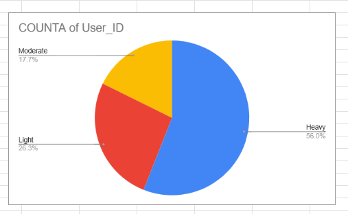
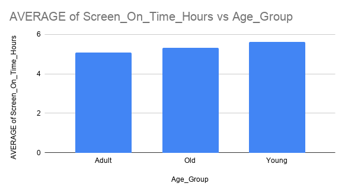
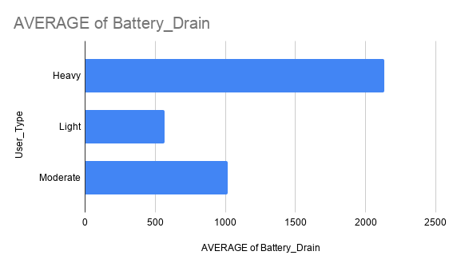

# 📱 Mobile Usage Behavior Analysis

## 📌 Overview
This project analyzes mobile usage behavior to identify user patterns and trends using spreadsheet tools. The goal is to understand how users interact with their mobile devices and derive meaningful insights through data visualization.

---

## 🛠️ Tools & Technologies

---

## 🎯 Objectives
- Analyze user behavior based on screen time and usage patterns  
- Identify trends across different age groups  
- Understand the relationship between usage behavior and battery consumption  

---

## ⚙️ Data Preparation & Techniques
- Data cleaning and formatting using Excel/Google Sheets  
- Use of Pivot Tables for summarizing data  
- Creation of charts for visual analysis  
- Basic exploratory data analysis (EDA)  

---

## 📊 Dashboard Preview

**👥 User Distribution**  

**📱 Screen Time by Age Group**  

**🔋 Battery Usage by User Type**  

---

## 📈 Key Insights
- Most users fall under moderate to high usage categories  
- Younger age groups show significantly higher screen time  
- Higher screen time is associated with increased battery consumption  
- Usage behavior varies clearly across different user segments  

---

## 📁 Dataset
The dataset used in this project is included in this repository for reference and reproducibility.

---

## 🧾 Conclusion
This project demonstrates how spreadsheet tools like Excel/Google Sheets can be used for data analysis, visualization, and deriving actionable insights from raw datasets.

---

